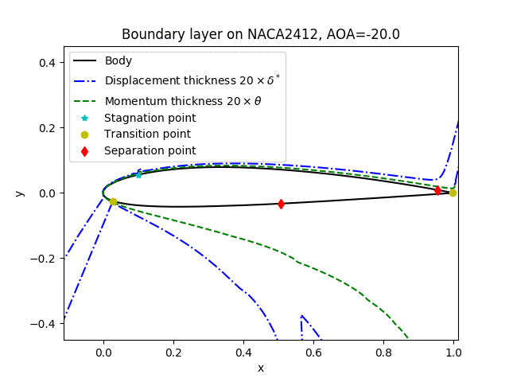

# MyPanel2D

Two-dimensional panel method for the calculation of aerodynamic properties of
bodies. For a detailed description of the methods implemented here, see the
documentation under `docs/MyPanel2D_documentation.ipynb`.

Developed in Feb 2018 by Eduardo Alvarez.

